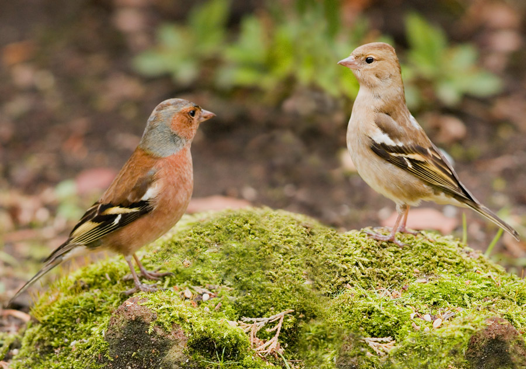

```{r setup, include=FALSE}
knitr::opts_chunk$set(echo = FALSE, 
                      warning = FALSE,
                      message = FALSE,
                      fig.retina = 3)
```

```{r packages}
library(tidyverse)
library(bookdown)
library(citr)
```

# Introduction
Chaffinches (*Fringilla coelebs*) are one of the most wide spread and abundant birds in Britian [@noauthor_undated-dq]. The average weight of the chaffinch is around 24g [@noauthor_undated-js] but it is unstated whether there is a difference between male and female averages. Since male and female chaffinches have such widely varying colour and plumage (see Figure \@ref(fig:chaff-fig)) it is reasonable to assume they would differ in mass too. That's what our analysis hopes to uncover.

(ref:chaff-cap) Photo of a male (left) and a female (right) chaffinch showcasing their differing colour patterns. Copyright ©2007, Fonzy, https://myolympus.org/document.php?id=9285

```{r chaff-fig, out.height="200px", fig.cap='(ref:chaff-cap)'}


```

# Methods

```{r import data}
# the working directory is in the scripts folder
# had to use backwards relative path to get to data
chaff_raw <- read.table("../data_raw/chaff.txt", header = T)
```

```{r tidy data}
chaff_tidy <- pivot_longer(data = chaff_raw,
                           cols = everything(),
                           names_to = "sex",
                           values_to = "mass")
```

```{r create sumsq function, include=FALSE}
# the double braces are used to indicate a column of a dataframe
sum_sq <- function(df, measure, group) {
  df %>% group_by({{ group }}) %>% 
    summarise(ss = sum(({{measure}} - mean({{measure}}))^2))
}

sum_sq(chaff_tidy, mass, sex)
```

```{r summary}
chaff_sum <- chaff_tidy %>%
  group_by(sex) %>%
  summarise(mean = mean(mass),
            std = sd(mass),
            n = length(mass),
            se = std/sqrt(n))
```

We measured the mass of `r chaff_sum$n[1]` chaffinches for both sexes and used R [@R] along with the tidyverse package [@tidy] to analyse the results to see if there is a significant difference between the mass of the sexes.

# Results

```{r statistics-test}
#Test the significance of the mass differnce using t.test
t_test <- t.test(data=chaff_tidy, mass~sex)
#Save the p-value output for in-line reporting
chaff_p <- t_test$p.value
```


```{r summary-table}
knitr::kable(chaff_sum,
             digits = 2,
             caption = 'A summary of the data.',
             row.names = FALSE)
```

The summary of the data (See Table \@ref(tab:summary-table)) shows that males are approximately 2g heavier than females. Using a t.test we found that this was statistically significant (p-value = `r round(chaff_p, 3)`) which means that males are in fact on average larger than females. This can also be seen in Figure (ggplot)

(ref:chaff-plot) Box plot of the mass of chaffinches (g) for males and females, points show individual measures.

```{r chaff-plot, fig.cap='(ref:chaff-plot)'}
chaff_tidy %>%
  ggplot( aes(x=sex, y=mass, fill=sex)) +
  geom_boxplot() +
  geom_jitter(color="black", size=0.4, alpha=0.9) +
  theme_bw()+
  ggtitle("Mass of Chaffinches by Sex") +
  xlab("Sex")+
  ylab("Mass (g)")

```


```{r summary-function, include=FALSE}
# create function that summarizes data and includes
# mean, sd, smaple size, se
#THIS IS FOR REFERENCE ONLY ATM IM NOT USING IT
data_summary <- function(df, measure, group){
 df %>% group_by({{group}}) %>% 
  summarise(mean = mean({{measure}}),
            n = length({{measure}}),
            sd = sd({{measure}}),
             se = sd/sqrt(n))
}

data_summary(chaff_tidy, mass, sex)
```


# Disscussion

# References